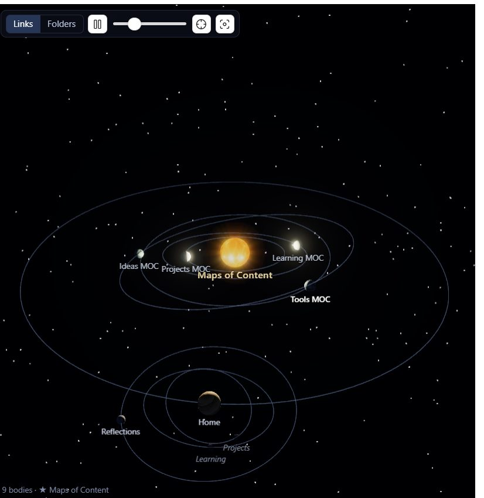
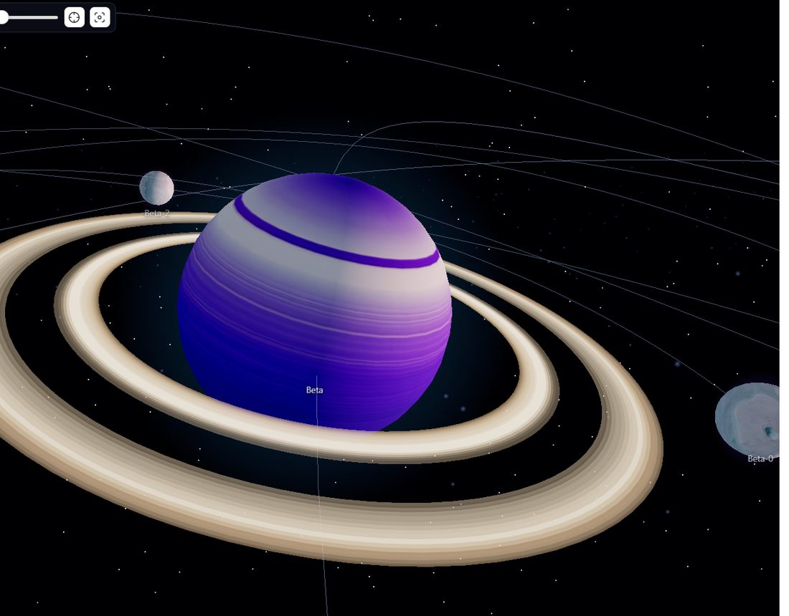
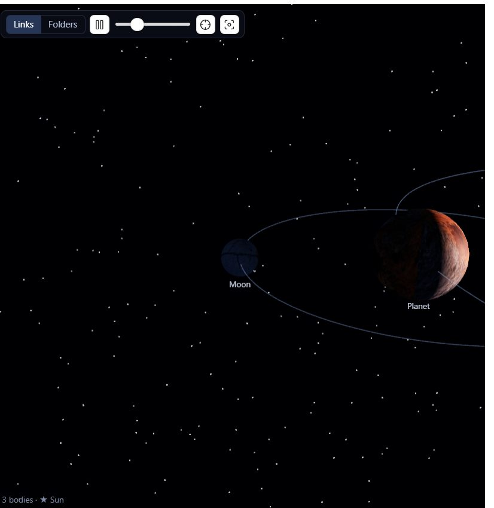
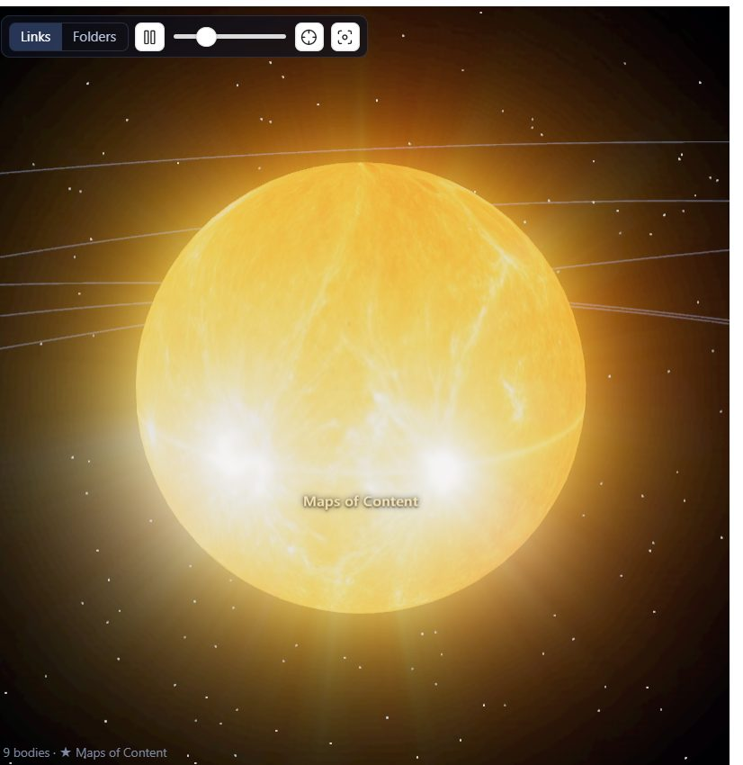

# Solar Graph

A 3D graph view for Obsidian built like a solar system. Notes become glowing
bodies: a **star** at the centre, **planets** orbiting it, **moons** orbiting
those, as deep as your vault goes — with real lighting, cast shadows and eclipses.



## Install

**From Obsidian** — Settings → Community plugins → Browse → search for
*Solar Graph* → Install → Enable.

**Manually** — download `main.js`, `manifest.json` and `styles.css` from the
[latest release](../../releases/latest), put them in
`<your vault>/.obsidian/plugins/solar-graph/`, and enable the plugin in Settings →
Community plugins. (Everything the plugin needs is in those three files; the
surface maps are built into `main.js`.)

**Beta** — add the repository in
[BRAT](https://github.com/TfTHacker/obsidian42-brat).

Desktop only: it needs WebGL, and it is not a good use of a phone battery.

## What it does

- **Real nested orbits.** A note's children are attached to the note itself, so
  when a planet swings around its star it carries its own moons along with it.
- **Kepler's third law.** Inner orbits move faster than outer ones, so the
  motion feels like a real system instead of a spinning pinwheel.
- **Photographic surfaces.** Every body wears a generated surface map — cloud
  bands, craters, fractured ice, plasma — with two or three variants per class,
  picked per note, so siblings don't look cloned. See [Body types](#body-types).
- **Rings, belts and dust.** Well-connected notes get Saturn-style rings,
  unlinked notes tumble in an asteroid belt, and stars burn inside a corona.
- **Real light.** Each star lights its own system and casts shadows, so a moon
  passing behind its planet is genuinely eclipsed and a planet punches a notch
  through its own rings. Volumetric shafts stream out past whatever blocks them.
- **Two ways to decide what orbits what** (switchable in the view's toolbar):
  - **Links** — a *spanning tree* built from your `[[wikilinks]]`. Obsidian's
    link graph has loops, and orbits can't, so the plugin walks outward from a
    root note and gives each note the first parent that reaches it. Links that
    don't fit the tree are drawn as faint straight chords instead of orbits.
  - **Folders** — the vault's folder structure. Folders are worlds, the files
    inside them orbit. Every link becomes a chord.
- **Unresolved links** (`[[notes you haven't written]]`) show up as dim,
  translucent ghosts, so gaps in the vault are visible.
- **Disconnected clusters** — notes that link to each other but not to the main
  graph — become their own star systems, drifting slowly around the main one.

## Body types

A note's appearance is decided entirely by **structure**: how many notes orbit
it, and whether anything links to it at all. Nothing to configure, and it works
on any vault. The more a note anchors, the more substantial the world.

| Size | Body | Looks like |
| --- | --- | --- |
| **14+ descendants** | **Star** | Burning plasma, a corona, and it lights its own system |
| 8+ children | Gas giant **+ rings** | Jupiter — ochre and cream cloud bands |
| 5–7 children | Ice giant **+ rings** | Neptune — azure and teal bands |
| 3–4 children | Terrestrial world | Mars, volcanic basalt, or desert dunes |
| 1–2 children | Rocky world | The Moon — grey, heavily cratered |
| no children | Ice moon | Europa — pale fractured ice |
| *no links at all* | Asteroid | A dark, lumpy, tumbling rock in the belt |
| *link to a missing note* | Ghost | Dim and translucent |

The root of each system is always a star. Beyond that, **a note carrying a whole
region of the vault becomes a star in its own right** — not just a big planet —
and lights everything orbiting it. "Carrying" counts the full subtree: children,
grandchildren, and so on down. The threshold is the **Stars** slider in settings;
set it to 1 to leave only the roots as stars.

So a hub note with 60 notes beneath it burns at the centre of its own
constellation, with its planets and moons lit by it rather than by the far-off
primary. Each class has 2–3 surface variants chosen by note path, so two ice
moons side by side aren't identical, and a star's corona and light take their
colour from whichever surface it drew (gold, blue-white, or crimson).

Note that an unwritten `[[link]]` counts as a child, because it really is
orbiting the note that mentions it.



### The asteroid belt

Notes with no links in *either* direction don't get a lonely one-note system of
their own — they collect into a belt orbiting the main star, scattered across a
few tight sub-rings with dust between them. Planets orbit both inside and outside
it. A note whose only link points at a page that doesn't exist yet is *not*
counted as unlinked: it has a ghost orbiting it, so it stays a world.

In folder mode unlinked notes still render as asteroids, but they stay in their
folder rather than being pulled out into a belt — the folder tree is the point
of that mode.

## Light, shadow and haze




Each star's light is **local**: it falls off with distance and stops beyond its
own system's reach. That's what makes an eclipse visible — with one uniform light
per vault, a moon sitting in its planet's shadow is still lit by every other star
and the shadow never shows.

- **Star brightness** and **light falloff** control how hard the stars shine and
  how fast that light dims with distance (0 even, 1 linear, 2 inverse-square).
- **Nearest star dominates** fades every star but the closest one right down. It
  defaults to on, and it matters more than it sounds: see below.
- **Star halo** and **corona** size the glow and the plasma motes around a star.
- **Shadows** (off / low / medium / high) trade sharpness for cost. A point
  light's shadow is a cube map — six renders per light per frame — so each step
  up also allows one more star to cast. Past 900 bodies shadows switch themselves
  off rather than letting the view crawl; the status line says so when that
  happens.
- **Shadow depth** sets how dark an eclipsed or night-side surface goes. It is the
  ambient fill — the *only* light reaching a shadowed face — so turn it up for
  drama and down to keep night sides readable.
- **Light shafts** are volumetric rays streaming from the nearest star, carved
  into beams by whatever passes in front of it. The most expensive effect here —
  turn this off first if the frame rate suffers.
- **Interstellar haze** is fog through the system: depth cues, and something for
  the shafts to travel through. 0 is clear vacuum.
- **Glow** is bloom around bright surfaces. 0 disables the pass.

On this machine a 64-body system holds 60fps with everything on, including
shadows at high.



### Why eclipses need nothing else glowing

Bodies have **no self-illumination at all**, and that is deliberate. Giving each
one a faint emissive copy of its own surface map makes night sides readable, but a
body that glows on its own can't be eclipsed: the shadow lands and the surface
lights itself straight back up.

Measured on a forced alignment — a moon parked exactly on the line from the star
through its planet — self-illumination contributed about 70 brightness units out
of 107 while the star's direct light contributed only 29. The shadow was working
perfectly and removing a quarter of the light, which is invisible. With the
emissive map gone the same eclipse takes the moon from 170 down to 34. `test/eclipse.js`
sets that alignment up and reports where to measure.

The corollary is that ambient light is the only fill, which is why **shadow depth**
is the dial that decides whether eclipses read at all.

### Two stars, one seam

A body sitting between two stars gets lit from both sides, leaving a dark valley
where the two pools of light meet. Distance falloff alone can't fix it: each star's
intensity is scaled to the size of its own system, so a large distant star and a
small nearby one arrive at about the same strength — measured at 6.8 versus 5.5 on
a moon deep inside a nested star's system, a ratio of 1.2.

three.js can't help here. `Light.layers` filters lights against the **camera**, not
against each object, so a light cannot be restricted to one subsystem — verified by
putting a light on a layer no object uses and watching the scene stay lit.

So **nearest star dominates** picks a winner each frame and fades the others to 12%,
crossfading so moving the camera between systems doesn't switch the lighting with a
jump. That takes the same measurement from 1.2 to 10, which is a single clean
terminator. Turn it off for honest multi-star lighting and the seam comes back.

### On "caustics"

Genuine caustics — light focused by refracting through water or glass — have
nothing to refract through here, so there was nothing to implement. What was
built instead is light *scattering*: the shafts, the haze they travel through,
and bloom. That's the effect caustics were being asked for in a solar system.

The shafts are also a screen-space approximation rather than a true raymarch
through a fog volume. The star is rendered alone into a small buffer, everything
solid is painted over it in black, and that buffer is smeared radially away from
the light. The black occluders are what carve shadows out of the rays. No
shadow-map lookups, no depth integration, one extra half-resolution render — and
it reads as light propagating through haze while running on a laptop.

## Using it

Open it from the ribbon icon on the left, or the command palette →
*Open solar graph*.

| Action | Result |
| --- | --- |
| Drag | Rotate the camera |
| Scroll | Zoom |
| Right-drag | Pan |
| Hover a body | Name + details |
| Click a body | Open that note and follow it as it orbits |
| Ctrl/Cmd-click | Open the note in a new tab |
| Alt-click | Make that note the star and rebuild around it (link mode) |
| `Space` | Pause / resume the orbits |
| `R` | Frame the whole system again |
| `Esc` | Deselect |

The toolbar has the Links/Folders switch, pause, a speed slider, "re-root on the
open note", and "frame everything".

Everything else lives in **Settings → Community plugins → Solar Graph**: spacing,
body size, orbit tilt, labels, cross-links, the maximum number of bodies, the
**Stars** threshold, and the whole of [Light, shadow and haze](#light-shadow-and-haze)
— shadows, shadow depth, light shafts and their strength, interstellar haze, and
glow — plus switches for **surface textures**, **planetary rings** and **particle
effects**. Every effect can be turned off independently if the frame rate suffers
on older hardware.

Belt debris is never labelled automatically — thirty names stacked on one ring is
unreadable — but hovering still names any single rock.

## How the layout avoids collisions

Sibling systems are packed into **disjoint rings**. Each note knows the radius of
its *entire* subsystem, and siblings are given ring positions far enough apart
that those subsystem spheres can never touch, at any point in the orbit or any
tilt. Wide fan-outs (a note with dozens of links) share rings rather than
sprawling outward forever; bodies sharing a ring are kept coplanar and evenly
spaced, because two same-size circles in different planes would cross.

Belt debris is scattered vertically off its ring, which is what makes a belt look
like a belt. That displacement counts towards the room each rock claims, because
lifting a body off its ring changes its distance from the star and would
otherwise eat into the clearance between neighbouring orbits.

`test/smoke.ts` asserts all of this — including a brute-force check that no two
bodies intersect at several sampled moments in time.

## Textures

The surface maps in `textures/` were generated with Stability AI on Amazon
Bedrock and are checked in, so nothing is fetched at runtime. A missing map just
falls back to a flat coloured sphere for that body class.

```bash
cd textures
bash generate.sh     # regenerate the plates in raw/ (skips ones already there)
python process.py    # crop, resize and convert them into the shipped maps
```

`generate.sh` holds the prompts, including notes on what didn't work — the
generators very much want to draw *a photo of a planet* (a curved limb, black
letterbox bars, an oval projection), and all of those wrap onto a sphere badly.
`process.py` crops the borders away, because a black row at the edge of a plate
becomes a black smear at the pole.

Two quirks worth knowing:

- Sphere maps want an **equirectangular** 2:1 layout, where the top and bottom
  rows are the poles. `21:9` is the closest ratio the model offers and is
  resized to 2:1.
- Two prompt lessons, both learned the hard way and both written into the script:
  anything mentioning continents, oceans or "a planet map" returns **literal
  Earth**, however it's phrased and whatever the negative prompt says — ask for
  "terrain seen from directly overhead" instead. And a blue-white *star* returns a
  nebula every single time; `star-2` is therefore **derived** from `star-1` by
  `process.py`, remapping luminance through a hot-blue ramp, which keeps the
  granulation and changes only the colour.
- The ring map is read **radially** (left edge = closest to the planet), so it's
  generated as vertical stripes, averaged down the rows into a clean profile, and
  its brightness becomes transparency so the gaps between bands are real gaps.
- `raw/` holds the full-size generated plates (~22 MB). They're only needed to
  re-run `process.py`; delete them freely and re-run `generate.sh` if you ever
  want them back.

## Development

```bash
npm install
npm run dev      # rebuild on save (then Ctrl+P → "Reload app without saving")
npm run build    # typecheck + minified production bundle
npm test         # headless checks for the tree builders and the layout
```

### Verifying in the live app

`npm test` covers the tree builders and the layout maths, but not rendering. For
that, start Obsidian with a debug port and drive it over the DevTools protocol:

```bash
# close Obsidian first
"$LOCALAPPDATA/Programs/obsidian/Obsidian.exe" --remote-debugging-port=9222 \
  "obsidian://open?vault=Claude%27s%20room"

node test/inspect.mjs "window.app.plugins.plugins['solar-graph'] != null"
node test/inspect.mjs test/interaction.js shot.png   # hover, click, folder toggle
node test/inspect.mjs test/verify.js shot.png        # re-rooting, flat mode, keys, fps
node test/inspect.mjs test/demo-graph.js shot.png    # every body type at once
node test/inspect.mjs test/closeup.js shot.png       # park the camera on one body
```

`inspect.mjs` takes an expression or a `.js` file, prints the result plus any
errors the page logged, and can save a screenshot. Reload the plugin after a
rebuild with:

```bash
node test/inspect.mjs "window.app.commands.executeCommandById('app:reload')"
```

Because TypeScript's `private` is compile-time only and esbuild doesn't rename
properties, the scripts can reach into `leaf.view.scene` to read camera state,
project a body to screen coordinates and so on.

`demo-graph.js` is worth knowing about: a vault with no unlinked notes and nothing
with 5+ children shows none of the giants, rings or the belt. Rather than writing
throwaway notes, it swaps the metadata cache for a synthetic vault in memory,
rebuilds the view, and leaves the disk untouched. Reload the app to restore.

`eclipse.js` builds a three-body vault, forces the moon onto the shadow axis and
returns the pixel to sample, so "are eclipses working" is a measurement rather
than an opinion. It also accepts `ambient` and `emissive` overrides for working out
what is filling a shadowed surface back in.

`closeup.js` parks the camera a few radii from one body, which is the only way to
actually see a surface map, a ring shadow or a terminator. Set the target first:

```bash
node test/inspect.mjs "window.__solarCloseup={id:'Beta.md', zoom:4.5}"
node test/inspect.mjs test/closeup.js shot.png
```

Caveats:

- Synthetic `PointerEvent`s make OrbitControls throw on `setPointerCapture` (no
  real pointer has that id). Harmless, and only when scripting the canvas.
- `Log.enable` replays the page's existing log buffer, so a stale error from an
  earlier run can look new — check the line numbers.
- A **minimised or hidden** window gets no animation frames at all, so anything
  measuring frame rate reads zero and any query about on-screen positions divides
  by a zero-sized canvas. `inspect.mjs` calls `Page.bringToFront`, but that can't
  un-minimise; restore the window from the OS first. Check `document.hidden`
  before believing a measurement.
- An **occluded** window (fully covered by another, not minimised) also reports
  `document.hidden`, and Windows blocks focus-stealing so it can't reliably be
  raised from a script. `inspect.mjs` captures with `fromSurface: false`, which
  renders from the renderer instead of the OS surface, and the test scripts call
  `scene.tick()` by hand when hidden — without both, every screenshot is a stale
  frame and repeated measurements come back suspiciously identical.
- Shader errors show up in the page log rather than breaking the build — worth
  checking after touching the light shaft pass. (GLSL has no reserved-word
  protection either: naming a variable `step` silently shadows the built-in
  `step()` and the shader fails to compile.)

The shipped plugin is `main.js`, `manifest.json`, `styles.css` and `textures/`;
`src/`, `test/`, `textures/raw/` and `node_modules/` are build-time only.

| File | Role |
| --- | --- |
| `src/main.ts` | Plugin entry: view registration, ribbon, commands, settings plumbing |
| `src/graph.ts` | The two tree builders (links, folders) and the graph model |
| `src/classify.ts` | Structure → body type: giants, worlds, moons, asteroids, ghosts |
| `src/layout.ts` | Sizes, orbital packing, the belt, tilts, Kepler speeds, colours |
| `src/scene.ts` | three.js scene, transform nesting, materials, rings, particles, lights, shadows, post-processing, picking, camera |
| `src/view.ts` | The Obsidian view: toolbar, tooltip, status line, texture loading, rebuild triggers |
| `src/settings.ts` | Settings model, defaults and the settings tab |
| `textures/` | Surface maps, plus the scripts that generate and process them |

### Releasing

`.github/workflows/release.yml` does the work. Bump the version in
`manifest.json`, `package.json` and add an entry to `versions.json`, then push a
tag matching that version:

```bash
git tag 1.0.1 && git push origin 1.0.1
```

The workflow checks the tag against `manifest.json`, runs the tests, builds, and
attaches `main.js`, `manifest.json` and `styles.css` to a new release as three
separate files. Obsidian downloads them by name, so they must not be zipped, and
the tag must not have a leading `v`.

### Working on it against a real vault

`npm run build` writes `main.js` next to the manifest. To try it in a vault,
either symlink this folder into `<vault>/.obsidian/plugins/solar-graph`, or copy
the three runtime files across after a build:

```bash
cp main.js manifest.json styles.css "<vault>/.obsidian/plugins/solar-graph/"
```

### Notes

- `main.js` is ~1.2 MB: about half is three.js, the rest is the 21 embedded
  surface maps.
- `textures/raw/` (the full-size generated plates, ~40 MB) is deliberately not
  committed. It is only needed to re-run `process.py`; `generate.sh` will rebuild
  it if you ever want to.

## Credits

- Rendering by [three.js](https://threejs.org).
- Surface maps generated with Stability AI models on Amazon Bedrock, then cropped
  and re-projected by `textures/process.py`. See `textures/generate.sh` for the
  prompts, including notes on what didn't work.

## License

[MIT](LICENSE)
